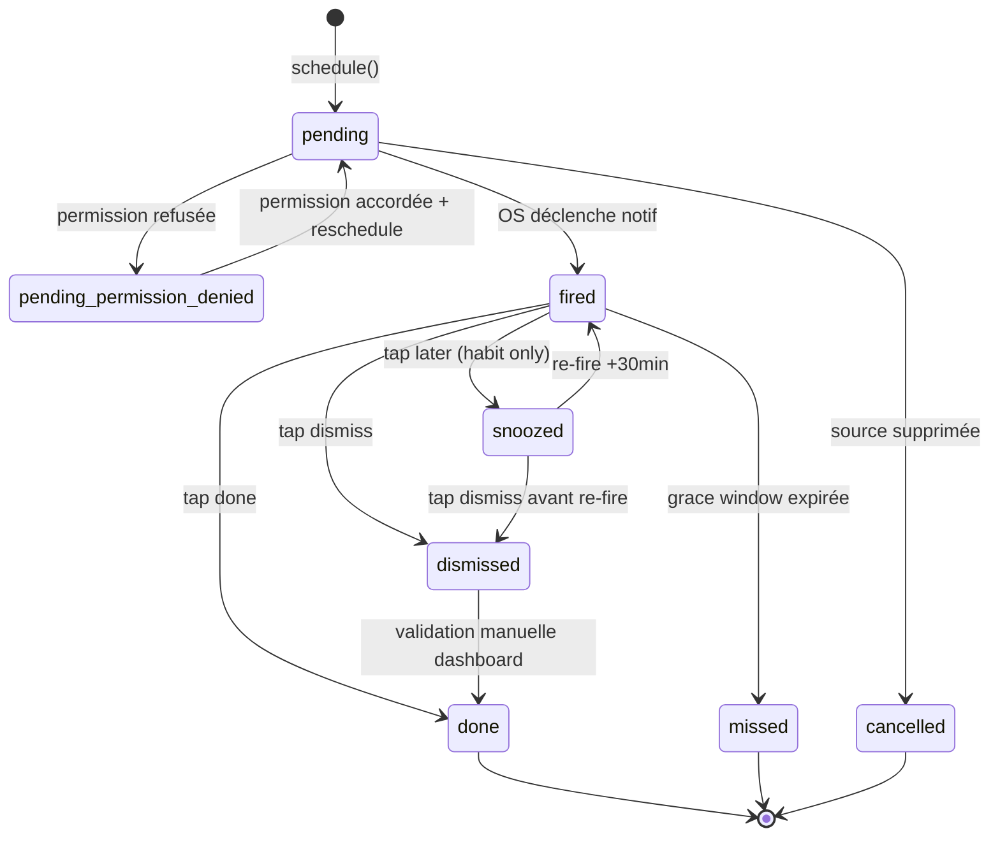
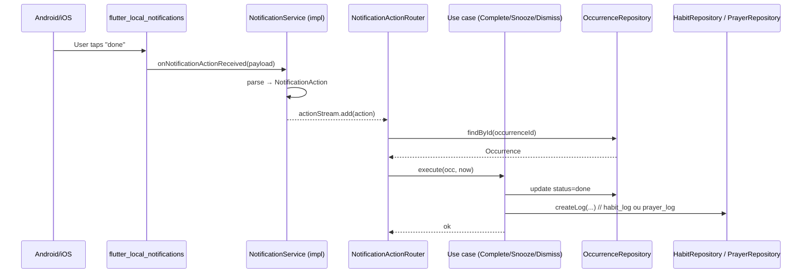
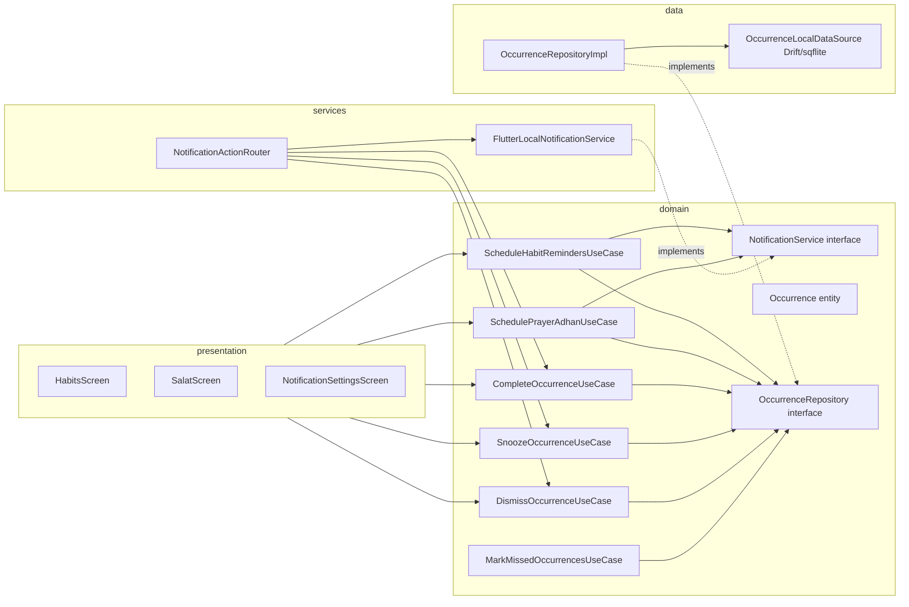

# ADR-018 — Alert System Architecture (occurrence model, notification contracts, scheduling)

**Statut** : Accepté
**Date** : 2026-05-23
**Décideur** : Cherif (PO) + agent senior mobile
**Slice associée** : MOB-001 (Phase 0.5 — Alert System v1, blocage MOB-002..007 + BUG-002/004)
**Issue** : [#169](https://github.com/Maximus203/murabbi-mobile/issues/169)
**Liés** :
- ADR-001 (clean archi) — sens des dépendances `presentation → domain ← data`, services injectés
- ADR-005 (offline cache strategy) — file d'occurrences résiliente offline
- ADR-006 / ADR-007 / ADR-008 (modèles habitudes : fréquence, plages horaires, target/timer)
- ADR-013 (prayer times — `adhan_dart` on-device)
- ADR-014 (geolocation — `geolocator` pour SA-02)
- ADR-016 (Riverpod legacy providers)
- ADR-017 (media delivery — non lié directement, mentionné pour traçabilité)
- CDC v1 §5 (grace window), §6 (UX notifications), §13 (obligations prière)

---

## 1. Contexte

La Phase 0.5 « Alert System v1 » regroupe deux familles d'alertes utilisateur :

1. **Prière** (Salat) — 5 prières quotidiennes, horaires calculés on-device par
   `adhan_dart` (ADR-013), notification à l'heure exacte pour rappeler que la
   fenêtre d'accomplissement s'ouvre.
2. **Habitudes** (Habits) — rappels planifiés selon la fréquence (`daily`,
   `perWeek`, `perDay`, `weekdays`, `monthly` — cf. ADR-006), avec optionnellement
   plages horaires (ADR-007) et timer in-app (ADR-008).

Avant MOB-001, **aucune notification n'est implémentée**. Le package
`flutter_local_notifications: ^17.2.3` est déclaré dans `pubspec.yaml` (cf. Q-15a)
mais aucun service ne le consomme. Le dossier `lib/services/` ne contient pas
encore de `notification_service.dart`. Les écrans dépendant des notifications
(HB-DETAIL action « me rappeler », SA-01 indicateur « notif activée »,
`settings/notifications_screen.dart`) sont stubés ou absents.

Les issues bloquées par cet ADR :

| Issue | Sujet | Pourquoi cet ADR la débloque |
|---|---|---|
| MOB-002 | `NotificationService` interface + impl `flutter_local_notifications` | Contrats d'API (cf. §4.1) |
| MOB-003 | Schéma `notification_occurrences` (Drift local + Supabase optionnel) | Modèle d'occurrence (cf. §4.2) |
| MOB-004 | `ScheduleHabitRemindersUseCase` | Règles de matérialisation (cf. §5.2) |
| MOB-005 | `SchedulePrayerAdhanUseCase` | Règles spécifiques prière (cf. §5.1) |
| MOB-006 | Notification actions handler (`done` / `later` / `dismiss`) | Contrats d'actions (cf. §4.3) |
| MOB-007 | UI réglages notifications (NOT-01) | États visibles + permissions |
| BUG-002 | Notif fantôme après suppression habitude | Cycle de vie occurrence (cf. §5.4) |
| BUG-004 | Snooze prière propose un report | Règle métier « no snooze » (cf. §3.2) |

L'enjeu : poser un **modèle d'occurrence** unique et un **contrat de service**
unique qui servent à la fois prière et habitudes, sans dupliquer la logique.

---

## 2. Pré-requis et contraintes

### 2.1 — Contraintes produit (CDC)

- **CDC §5 — Grace window** : une habitude rappelée à 08:00 reste validable
  sans pénalité jusqu'à 23:59 du même jour local. Au-delà, l'occurrence passe
  en `missed` et déclenche la pénalité de score. Les notifications **ne sont
  pas re-tirées** automatiquement après 08:00 — l'occurrence reste « en
  attente » et l'utilisateur peut la valider depuis le dashboard.
- **CDC §6 — UX notifications** : trois actions doivent être proposées sur
  chaque notification habitude :
  - `done` → log l'habitude en `completed` (statut `onTime` si dans la
    fenêtre, `late` au-delà, jamais `missed` depuis une action utilisateur).
  - `later` → re-programme une notification +30 min (max 2 reports
    consécutifs, cf. §3.3).
  - `dismiss` → ferme la notif sans logger (l'occurrence reste « en
    attente » jusqu'à la fin de la grace window).
- **CDC §13 — Prière** : les 5 prières sont obligatoires, à heure fixe
  astronomique. **Aucun snooze possible** sur une notification de prière —
  seules les actions `pray` (équivalent `done`) et `dismiss` sont offertes.
  Re-proposer un report serait théologiquement incorrect (BUG-004).
- **P-7 (plages horaires)** : aucune notification entre 22h00 et 07h00 par
  défaut, sauf override explicite utilisateur. La notification de Fajr est
  l'exception structurelle (Fajr peut tomber à 05:30 selon saison/lieu).

### 2.2 — Contraintes techniques

- **Offline-first** (ADR-005) : les occurrences sont planifiées on-device,
  persistées localement. Pas d'appel réseau nécessaire pour qu'une notif
  parte.
- **Pas de codegen** (ADR-016) : providers Riverpod legacy manuels.
- **Isolation d'import** : `package:flutter_local_notifications/*` doit être
  importé **uniquement** dans `lib/services/notification/` (même règle que
  `adhan_dart` ADR-013, `geolocator` ADR-014).
- **Android API 35 / minSdk 21** (CLAUDE.md §15) : `flutter_local_notifications`
  17.x supporte les exact alarms Android 13+, scheduled notifications iOS 10+.
- **`flutter_local_notifications` 17.x** est compatible — pas de bump nécessaire.

### 2.3 — Contraintes de cohérence ADR

| ADR | Point de cohérence vérifié |
|---|---|
| ADR-013 | `PrayerTimesService` retourne déjà 6 `DateTime` (fajr, sunrise, dhuhr, asr, maghrib, isha) — c'est l'input direct de `SchedulePrayerAdhanUseCase`. ✅ |
| ADR-014 | Si l'utilisateur n'a pas configuré sa localisation, les notifs prière ne sont pas planifiables — il faut un état `unscheduled_no_location` (cf. §4.2). ✅ |
| ADR-006 | `Habit.frequencyType` détermine la cadence de matérialisation : `daily` → 1 occurrence/jour, `perWeek` N → N occurrences réparties (algorithme §5.2), `weekdays` → occurrences les jours flagués, `monthly` → 1 occurrence/mois au `monthlyDay`. ✅ |
| ADR-007 | `Habit.timeRange` (start/end heure locale) borne l'heure de planification de l'occurrence. Si pas de range, défaut 09:00 local. ✅ |
| ADR-008 | `HabitTarget.timed` implique un timer in-app séparé — il **ne déclenche pas** une notification supplémentaire (pas de « ton timer va expirer »). Le timer vit dans son propre cycle, indépendant de l'alert system. ✅ |

---

## 3. Décisions

### 3.1 — Modèle unifié « Occurrence »

**Une notification = une occurrence persistée.** Une `Occurrence` est l'unité
atomique du système d'alerte. Elle représente l'engagement « à l'instant T,
l'utilisateur doit être notifié pour l'item X (prière ou habitude) ».

Schéma logique (cf. §4.2 pour le DDL local) :

```
Occurrence {
  id: UUID                       // identifiant stable, sert aussi de notificationId tronqué
  source: enum                   // prayer | habit
  sourceId: UUID                 // habit_id ou prayer_id (les 5 prières sont des constantes)
  userId: UUID                   // owner
  scheduledAt: DateTime          // heure prévue (locale stockée en UTC)
  windowEndsAt: DateTime         // fin de la grace window (CDC §5)
  status: enum                   // pending | fired | acknowledged | snoozed | done | dismissed | missed | cancelled
  snoozeCount: int               // 0..2 (cf. §3.3)
  firedAt: DateTime?             // horodatage réel du déclenchement OS
  actedAt: DateTime?             // horodatage de l'action utilisateur
  payloadJson: text              // metadata libre (titre, body précalculés, deeplink)
  createdAt: DateTime
  updatedAt: DateTime
}
```

**Pourquoi ce modèle unifié** :

- Prière et habitudes partagent 95 % du cycle de vie (planifier, firer, agir,
  conclure). Deux schémas séparés multiplieraient le code de coordination.
- Permet une vue « toutes mes alertes du jour » (HM-01, CAL-DAY) sans union de
  deux tables.
- Permet un GC unique (purge des occurrences `done`/`missed`/`cancelled` > 90j,
  cf. §5.5).

### 3.2 — Actions de notification (contrat figé)

Trois action IDs **et trois seulement** côté `flutter_local_notifications`, mais
l'éventail offert dépend de `source` :

| Action ID | Habitude | Prière | Sémantique |
|---|---|---|---|
| `done` | ✅ | ✅ (libellé « Prié ») | Log `completed`. Statut `onTime`/`late` calculé selon `now()` vs `scheduledAt` + grace window |
| `later` | ✅ | ❌ (CDC §13) | Snooze +30 min (cf. §3.3) |
| `dismiss` | ✅ | ✅ | Ferme la notif sans logger. Occurrence reste `pending` jusqu'à fin grace window |

**Règle métier dure (BUG-004)** : si `source == prayer`, l'action `later` est
absente de la notification native. Le `NotificationService.show()` reçoit la
liste d'actions à afficher — le use case prière passe `[done, dismiss]`, le use
case habitude passe `[done, later, dismiss]`.

### 3.3 — Snooze : 2 reports max, +30 min, jamais sur prière

- Chaque tap sur `later` incrémente `snoozeCount` et re-planifie une nouvelle
  notification à `now + 30min` (la **même** occurrence est mise à jour, status =
  `snoozed`, on ne crée pas une nouvelle occurrence).
- Au-delà de `snoozeCount = 2`, l'action `later` n'est plus offerte — la
  notification suivante ne propose que `done` et `dismiss`.
- L'horaire `scheduledAt` original reste figé (pour le calcul `onTime`/`late`).
  Seul un champ `nextFireAt` (interne au service) bouge.
- **Aucun snooze possible sur `source == prayer`** : le bouton n'existe pas, la
  table SQL accepte `snoozeCount = 0` uniquement pour les prières (CHECK
  constraint, cf. §4.2).

### 3.4 — Permission OS : flow et fallbacks

- **Premier passage onboarding** : on **ne demande pas** la permission
  notification (cf. ADR-012 — onboarding pré-auth, pas de demande
  d'autorisation système avant que l'utilisateur soit logué).
- **Premier rappel planifié** (après création habitude ou activation
  notifications prière dans SA-02) : on demande la permission via
  `flutter_local_notifications.requestPermission()`.
- **Refus** : un état persistant `notificationsPermission: denied` est stocké
  dans `SharedPreferences`. Les use cases `ScheduleXxx` deviennent no-op
  silencieux mais persistent quand même les occurrences en DB (status =
  `pending_permission_denied`), pour qu'un futur opt-in puisse rejouer
  l'historique.
- **Re-demande** : seulement depuis NOT-01 (settings), jamais en push-prompt
  intempestif.

### 3.5 — Source de vérité du timing local : `DateTime` local stocké en UTC

- Toutes les colonnes `scheduledAt`, `windowEndsAt`, `firedAt`, `actedAt`
  stockent l'instant **en UTC** (timezone-aware).
- L'affichage et le calcul des fenêtres se font dans le timezone système au
  moment de l'usage.
- Cas DST : si la transition tombe entre `scheduledAt` planifié et `firedAt`
  réel, la notification part à l'instant UTC originel — cohérent avec le
  comportement de `flutter_local_notifications`. Documenté en commentaire dans
  `NotificationService` impl.

---

## 4. Contrats d'interface (figés — utilisés par MOB-002..007)

### 4.1 — `NotificationService` (interface domain)

Localisation : `lib/domain/services/notification_service.dart` (interface),
`lib/services/notification/flutter_local_notification_service.dart` (impl).

```dart
/// Service d'orchestration des notifications locales (cf. ADR-018).
/// Seul fichier d'impl autorisé à importer `flutter_local_notifications`.
abstract interface class NotificationService {
  /// Initialise le plugin (channels Android, catégories iOS, callbacks
  /// d'action). À appeler une fois au démarrage avant tout autre call.
  Future<void> initialize();

  /// Demande la permission. Retourne `true` si accordée, `false` si refusée.
  /// No-op (retourne l'état actuel) si déjà demandée.
  Future<bool> requestPermission();

  /// État actuel de la permission OS (granted / denied / notDetermined).
  Future<NotificationPermissionStatus> permissionStatus();

  /// Planifie ou re-planifie une notification pour une occurrence donnée.
  /// Idempotent — re-appeler avec le même `occurrenceId` annule la
  /// notification précédente et en planifie une nouvelle.
  Future<void> schedule(ScheduledNotification spec);

  /// Annule la notification pour une occurrence (ex: habitude supprimée,
  /// utilisateur a déjà loggé manuellement). Pas d'erreur si l'occurrence
  /// n'avait rien de planifié.
  Future<void> cancel(String occurrenceId);

  /// Annule toutes les notifications planifiées (purge complète, ex:
  /// logout).
  Future<void> cancelAll();

  /// Stream des actions utilisateur reçues (cold start + warm). Émet une
  /// `NotificationAction` à chaque tap sur un action button OU sur le
  /// body de la notification (action implicite `open`).
  Stream<NotificationAction> get actionStream;
}

/// Spec d'une notification à planifier.
class ScheduledNotification {
  final String occurrenceId;      // = Occurrence.id (PK partagée)
  final OccurrenceSource source;  // prayer | habit (pour choisir le channel)
  final DateTime scheduledAt;     // UTC
  final String title;             // précalculé par le use case (i18n appliquée)
  final String body;
  final List<NotificationActionId> actions;   // sous-ensemble de {done, later, dismiss}
  final Map<String, String> payload;          // sourceId, deeplink, etc.
}

enum OccurrenceSource { prayer, habit }
enum NotificationActionId { done, later, dismiss }
enum NotificationPermissionStatus { granted, denied, notDetermined }

class NotificationAction {
  final String occurrenceId;
  final NotificationActionId actionId;
  final DateTime receivedAt;
  final Map<String, String> payload;
}
```

**Pourquoi un Stream et pas un callback global** :

- Un Stream est testable (`StreamController` injectable dans les tests).
- Permet de brancher plusieurs subscribers (le `OccurrenceRepository` pour
  persister, le `HabitsNotifier`/`SalatNotifier` pour invalider leur cache).
- Compatible cold start : le service buffer les actions reçues avant que le
  premier listener s'abonne (replay des N dernières via `BehaviorSubject`-like).

### 4.2 — Schéma local `occurrences` (Drift / `sqflite`)

> Décision technique : persistence locale via **Drift** (recommandé senior) ou
> `sqflite` directement — à arbitrer en MOB-003. Le DDL ci-dessous est
> indépendant du choix.

```sql
CREATE TABLE occurrences (
  id                TEXT PRIMARY KEY NOT NULL,            -- UUID v4
  source            TEXT NOT NULL CHECK (source IN ('prayer','habit')),
  source_id         TEXT NOT NULL,                        -- habit_id ou prayer_id (fajr|dhuhr|asr|maghrib|isha)
  user_id           TEXT NOT NULL,
  scheduled_at      INTEGER NOT NULL,                     -- epoch ms UTC
  window_ends_at    INTEGER NOT NULL,
  status            TEXT NOT NULL
                      CHECK (status IN (
                        'pending','fired','acknowledged','snoozed',
                        'done','dismissed','missed','cancelled',
                        'pending_permission_denied'
                      )),
  snooze_count      INTEGER NOT NULL DEFAULT 0
                      CHECK (snooze_count BETWEEN 0 AND 2),
  next_fire_at      INTEGER,                              -- nullable si pas snoozée
  fired_at          INTEGER,
  acted_at          INTEGER,
  payload_json      TEXT NOT NULL DEFAULT '{}',
  created_at        INTEGER NOT NULL,
  updated_at        INTEGER NOT NULL,

  -- Règle ADR-018 §3.3 : pas de snooze sur prière
  CHECK (source <> 'prayer' OR snooze_count = 0),

  -- Unicité : une seule occurrence par (source, sourceId, scheduledAt) pour
  -- éviter les doubles si le scheduler tourne deux fois.
  UNIQUE (source, source_id, scheduled_at)
);

CREATE INDEX idx_occurrences_user_status ON occurrences (user_id, status);
CREATE INDEX idx_occurrences_next_fire   ON occurrences (status, next_fire_at);
CREATE INDEX idx_occurrences_source      ON occurrences (source, source_id);
```

**Cycle de vie des `status`** (machine à états, cf. diagramme §6) :

```
pending ──(scheduledAt atteint, OS fire la notif)──► fired
pending ──(utilisateur supprime l'item amont)─────► cancelled
pending ──(permission refusée au moment de schedule)► pending_permission_denied
fired   ──(tap done)──► done
fired   ──(tap later)─► snoozed  ──(timer +30min)──► fired
fired   ──(tap dismiss)► dismissed
fired   ──(grace window expirée sans action)────► missed
snoozed ──(tap dismiss avant re-fire)───────────► dismissed
dismissed ──(action ultérieure utilisateur via dashboard)► done   // réactivation manuelle
```

**Pas de Supabase en V1** : les occurrences sont **purement locales**. Les
`habit_logs` et `prayer_logs` (qui sont la source de vérité métier pour le
scoring) restent sur Supabase et sont écrits par le handler d'action `done`.
Une éventuelle sync Supabase des occurrences est différée (V1.5 — utile
seulement pour multi-device, hors scope Phase 0.5).

### 4.3 — Mapping `NotificationActionId` ↔ handler use cases

Géré par un `NotificationActionRouter` (singleton démarré au boot, écoute
`NotificationService.actionStream`) :

```dart
class NotificationActionRouter {
  Future<void> handle(NotificationAction event) async {
    final occ = await _occurrenceRepository.findById(event.occurrenceId);
    if (occ == null) return; // notification fantôme, BUG-002 ne doit plus se produire après cancel()

    switch (event.actionId) {
      case NotificationActionId.done:
        await _completeOccurrenceUseCase.execute(occ, event.receivedAt);
      case NotificationActionId.later:
        if (occ.source == OccurrenceSource.prayer) {
          // Défensif : si l'OS laisse passer un later sur prière (ne devrait
          // pas arriver car non offert), on l'ignore avec log warning.
          _logger.w('Snooze attempted on prayer occurrence ${occ.id}');
          return;
        }
        await _snoozeOccurrenceUseCase.execute(occ, event.receivedAt);
      case NotificationActionId.dismiss:
        await _dismissOccurrenceUseCase.execute(occ, event.receivedAt);
    }
  }
}
```

Use cases (interface, impl en MOB-006) :

- `CompleteOccurrenceUseCase` : marque occurrence `done` + crée
  `habit_log`/`prayer_log` (route vers le repo amont selon `source`).
- `SnoozeOccurrenceUseCase` : incrémente `snoozeCount`, set
  `nextFireAt = now + 30min`, status `snoozed`, ré-appelle
  `NotificationService.schedule()` avec le nouveau timing.
- `DismissOccurrenceUseCase` : status `dismissed`, pas de log écrit.
- `MarkMissedOccurrencesUseCase` (cron-like, ticker au démarrage et toutes les
  heures) : passe en `missed` toutes les occurrences `pending|fired|snoozed`
  dont `windowEndsAt < now`.

---

## 5. Règles de planification (par use case)

### 5.1 — `SchedulePrayerAdhanUseCase` (MOB-005)

**Trigger** : démarrage app + à chaque changement `PrayerSettings` (location,
méthode, madhab) + minuit local (rolling 7 jours).

**Algorithme** :

1. Lire `PrayerSettings` ; si pas de location → status `unscheduled_no_location`,
   return.
2. Lire `notificationsPrayerEnabled: Map<Prayer, bool>` depuis `SharedPreferences`
   (NOT-01 toggles individuels par prière).
3. Pour chaque jour D dans [today, today+7] (rolling window) :
   - Calculer `PrayerTimes(D)` via `PrayerTimesService` (ADR-013).
   - Pour chaque prière P activée :
     - `scheduledAt = prayerTimes[P]`
     - `windowEndsAt = prayerTimes[nextPrayer(P)]` (Asr → Maghrib, etc.).
       Pour Isha : `windowEndsAt = fajr(D+1)`.
     - Upsert occurrence `(source=prayer, sourceId=P, scheduledAt)` —
       l'UNIQUE constraint dédoublonne.
     - Si l'occurrence est nouvelle ou son `scheduledAt` a changé, appeler
       `NotificationService.schedule(...)` avec `actions: [done, dismiss]`.
4. Annuler les occurrences prière dont la prière a été désactivée
   (`NotificationService.cancel()` + status `cancelled`).

**Fenêtre de planification = 7 jours** : `flutter_local_notifications` limite
le nombre d'alarmes simultanées (~64 sur iOS). 5 prières × 7 jours = 35
notifications, marge confortable pour habitudes.

### 5.2 — `ScheduleHabitRemindersUseCase` (MOB-004)

**Trigger** : création/édition d'habitude + activation du toggle
« notifications » sur HB-DETAIL + démarrage app + minuit local.

**Algorithme par `frequencyType`** (rolling 7 jours) :

| `frequencyType` | Règle de matérialisation |
|---|---|
| `daily` | 1 occurrence/jour à `timeRange.start ?? 09:00` |
| `perWeek` N | N occurrences réparties uniformément sur les 7 prochains jours, à `timeRange.start ?? 09:00`. Si déjà N validées cette semaine, pas d'occurrence supplémentaire |
| `perDay` N | N occurrences/jour, espacées également entre `timeRange.start ?? 09:00` et `timeRange.end ?? 21:00` |
| `weekdays` | 1 occurrence sur chaque jour de `activeDays` à `timeRange.start ?? 09:00` |
| `monthly` | 1 occurrence à la date `monthlyDay` du mois courant ET du mois suivant si dans la window 7j |
| `custom` | V1 : pas de notification automatique (l'utilisateur valide manuellement). Documenté in-app |

**Plage horaire P-7** : si une occurrence calculée tombe entre 22h et 07h, elle
est repoussée à 07h00 le même jour (ou 07h00 J+1 si déjà passée). Exception :
les notifications prière (ADR-018 §2.1).

**Suppression d'habitude (BUG-002)** : le `DeleteHabitUseCase` doit appeler
`ScheduleHabitRemindersUseCase.cancelAllForHabit(habitId)` qui :

1. Récupère toutes les occurrences `(source=habit, sourceId=habitId, status IN (pending, snoozed))`.
2. Pour chacune : `NotificationService.cancel(occurrence.id)` + status `cancelled`.

C'est cette étape qui est manquante aujourd'hui et qui cause BUG-002. Le test
de non-régression : créer habit → planifier → supprimer → vérifier
`pendingNotificationRequests().isEmpty == true`.

### 5.3 — Re-planification au démarrage

Au cold start de l'app (après auth réussie) :

1. `NotificationService.initialize()` (channels, callbacks).
2. `MarkMissedOccurrencesUseCase.execute()` (rattrapage si l'app n'a pas
   tourné pendant N jours).
3. `SchedulePrayerAdhanUseCase.execute()` (refresh window 7j).
4. `ScheduleHabitRemindersUseCase.execute()` (refresh window 7j pour toutes
   les habitudes actives).

Étape 2-4 démarrent en parallèle, idempotents grâce à l'UNIQUE constraint et
à la sémantique « schedule() est upsert ».

### 5.4 — Cycle de vie inverse : ce qui annule une occurrence

| Évènement | Effet |
|---|---|
| Habitude supprimée | `cancelAllForHabit(habitId)` (BUG-002) |
| Habitude désactivée (`active = false`) | Idem |
| Habitude éditée (fréquence ou plage) | `cancelAllForHabit` + reschedule complet |
| Prière désactivée dans NOT-01 | `cancelAllForPrayer(P)` |
| Settings prière changés (méthode/madhab/location) | `cancelAllForPrayer(all)` + reschedule complet |
| Logout | `NotificationService.cancelAll()` + clear table occurrences |
| Permission OS révoquée | `cancelAll()` au prochain start détectant `permissionStatus = denied` |

### 5.5 — Garbage collection des occurrences

- Job lancé à chaque cold start (après auth) : supprime les occurrences avec
  `status IN (done, dismissed, missed, cancelled) AND updated_at < now - 90j`.
- 90 jours est arbitraire — couvre les besoins d'audit utilisateur (vue
  CAL-MONTH des 3 derniers mois) sans laisser la table croître indéfiniment.
- Les `habit_logs`/`prayer_logs` restent en Supabase sans limite — c'est eux
  la source de vérité historique pour le scoring.

---

## 6. Diagrammes

### 6.1 — Machine à états `Occurrence.status`



### 6.2 — Flow d'un tap utilisateur sur une notification



### 6.3 — Architecture de modules



---

## 7. Options envisagées et rejetées

### 7.1 — Option A : pas de table `occurrences`, juste planifier dans l'OS

Approche minimaliste : `flutter_local_notifications.schedule()` est la seule
source de vérité, on ne persiste rien côté app.

**Rejeté** parce que :

- Impossible de reconstruire l'état après revoke permission/désinstall partiel.
- BUG-002 (notif fantôme) devient impossible à débugger — pas de trace de ce
  qui était planifié.
- Pas de vue « occurrences du jour » pour HM-01 sans poller l'OS.
- `flutter_local_notifications.pendingNotificationRequests()` est limité
  (~64 sur iOS) et ne contient pas le `status`.

### 7.2 — Option B : deux schémas séparés `prayer_occurrences` + `habit_occurrences`

**Rejeté** parce que la duplication du cycle de vie (8 status, 5 use cases,
1 router) multiplierait par 2 la surface de code pour 5 % de différences
métier (pas de snooze, libellés). Le discriminant `source` + 2 CHECK
constraints suffisent.

### 7.3 — Option C : pousser tout vers Supabase + Edge Functions

Idée : Supabase planifie via cron, envoie des push FCM/APNs.

**Rejeté V1** parce que :

- Contradiction frontale avec ADR-013 (offline-first pour les prières).
- Dépendance Firebase Messaging non encore intégrée (pas dans `pubspec.yaml`).
- Latence réseau + risque de retard sur prière (théologiquement critique).
- À reconsidérer V2 pour des **rappels collaboratifs** (groupe de prière,
  challenges habitudes partagées).

### 7.4 — Option D : `workmanager` pour les rappels habitudes

Lib `workmanager` exécute du code Dart en background, ce qui permettrait des
rappels conditionnels (« notifier seulement si pas encore loggué aujourd'hui »).

**Rejeté V1** parce que :

- Ajout d'une dep native lourde (~200 KB APK).
- `flutter_local_notifications` couvre le besoin V1 (notification programmée
  simple).
- À reconsidérer V2 si on veut des règles conditionnelles complexes
  (« notifier si streak menacée »).

---

## 8. Conséquences

### Positives

- **Un seul contrat `NotificationService`** consommé par 5 use cases. Tests
  unitaires simples (fake `NotificationService` injecté via Riverpod).
- **BUG-002 résolu structurellement** : la suppression d'habitude DOIT passer
  par `cancelAllForHabit()`, et le test de non-régression est immédiat
  (`pendingNotificationRequests().isEmpty`).
- **BUG-004 résolu structurellement** : `source == prayer` ⇒ `actions` ne
  contient pas `later`. Le CHECK SQL backstop l'invariant.
- **Cohérence avec ADR-013/014** : pas de double source de vérité pour les
  horaires prière (toujours `adhan_dart`), pas de re-fetch GPS.
- **Offline-first** : aucune notif ne dépend du réseau. App utilisable en
  mode avion.

### Négatives / dette acceptée

- **Pas de sync multi-device des occurrences V1** : si l'utilisateur logue une
  habitude depuis le web (admin/companion), la notif mobile partira quand
  même tant qu'elle n'a pas été rejouée à l'ouverture suivante. Mitigation :
  au cold start, `MarkMissedOccurrencesUseCase` détecte les `habit_logs`
  existants pour la fenêtre courante et annule les occurrences correspondantes.
  Documenté.
- **Window 7 jours** : si l'utilisateur n'ouvre pas l'app pendant > 7 jours,
  les notifications du 8e jour ne partent pas. Acceptable V1 (un utilisateur
  qui n'ouvre pas Murabbi pendant 7j n'attend pas activement de notifs).
- **Choix Drift vs sqflite reporté à MOB-003**. Recommandation senior :
  **Drift** (typage Dart strict, migrations versionnées, query builder
  testable) — mais la décision finale est dans MOB-003.
- **Pas de tests sur le déclenchement OS réel** : `flutter_local_notifications`
  ne se teste qu'en integration_test sur device réel. Les tests unitaires
  mockent `NotificationService` ; un test integration manuel sera documenté
  dans MOB-002 (« lancer l'app, planifier une occurrence à +30s, vérifier que
  la notif part avec les 3 boutons »).

### Neutres

- L'évolution future vers Supabase + FCM (V2) est non-bloquante :
  `NotificationService` reste l'interface, on swap juste l'impl.
- Le `payloadJson` non typé donne de la souplesse mais demande de la
  discipline : tout schéma est documenté dans `ScheduledNotification` (cf.
  §4.1) et le code de parse est centralisé dans `NotificationActionRouter`.

---

## 9. Dépendances et stack vérifiées

| Package | Version pubspec | Usage ADR-018 | Statut |
|---|---|---|---|
| `flutter_local_notifications` | `^17.2.3` | NotificationService impl | ✅ déjà présent |
| `flutter_riverpod` | `^2.6.1` | Providers (`occurrenceRepositoryProvider`, `notificationServiceProvider`) | ✅ déjà présent |
| `shared_preferences` | `^2.5.5` | Toggles NOT-01 par prière, `permissionStatus` cache | ✅ déjà présent |
| `logger` | `^2.3.0` | Logs warning sur BUG-004 défensif, debug du router | ✅ déjà présent |
| `adhan_dart` | `^2.0.0` | Input de `SchedulePrayerAdhanUseCase` (déjà encapsulé via `PrayerTimesService`) | ✅ déjà présent |
| Persistence locale | **non présent** | `occurrences` table | ⚠ **À ajouter en MOB-003** — recommandation `drift: ^2.18.0` + `drift_dev` (dev) + `sqlite3_flutter_libs`. Décision finale dans MOB-003 |
| `timezone` | non présent | `flutter_local_notifications` requiert `tz` data pour les scheduled local | ⚠ **À ajouter en MOB-002** : `timezone: ^0.9.4` + `flutter_native_timezone_updated_gradle` pour l'init du fuseau. Dette tracée |

**Action MOB-002** : ajouter `timezone` au `pubspec.yaml` + init dans
`NotificationService.initialize()` (`tz.initializeTimeZones()` +
`tz.setLocalLocation(tz.getLocation(await FlutterNativeTimezone.getLocalTimezone()))`).

---

## 10. Cross-check final (DoD MOB-001)

| Item | Vérif | Statut |
|---|---|---|
| Lifecycle states match CDC §5 grace window | `windowEndsAt` = 23:59 local pour habitudes, `nextPrayerTime` pour prière | ✅ |
| Action IDs `done`/`later`/`dismiss` consistent avec CDC §6 | §3.2 figé, libellés FR documentés | ✅ |
| Pas de snooze sur prière (CDC §13) | §3.3 + CHECK SQL `source<>'prayer' OR snooze_count=0` | ✅ |
| Pas de contradiction avec ADR-013 | Réutilise `PrayerTimesService` (zéro nouveau calcul) | ✅ |
| Pas de contradiction avec ADR-014 | `unscheduled_no_location` documenté §4.2 | ✅ |
| Pas de contradiction avec ADR-005 | Occurrences persistées localement, sync différée | ✅ |
| Packages ADR-018 présents dans pubspec.yaml | 5/7 présents ; `drift` et `timezone` flagués MOB-002/003 | ⚠ documenté §9 |
| Domain entities à ajouter | `Occurrence`, `OccurrenceStatus`, `OccurrenceSource`, `NotificationActionId`, `NotificationPermissionStatus`, `ScheduledNotification`, `NotificationAction` → MOB-002 ajoutera ces entités à `docs/architecture/domain_entities.md` | ⚠ tracé pour MOB-002 |
| Use cases à ajouter à `use_cases_inventory.md` | `ScheduleHabitRemindersUseCase`, `SchedulePrayerAdhanUseCase`, `CompleteOccurrenceUseCase`, `SnoozeOccurrenceUseCase`, `DismissOccurrenceUseCase`, `MarkMissedOccurrencesUseCase`, `CancelOccurrencesForHabitUseCase` → MOB-002 ajoutera | ⚠ tracé pour MOB-002 |

**Questions ouvertes restantes pour le PO** (à clarifier avant MOB-004) :

1. **Q-OPEN-A** : pour `frequencyType == perWeek N`, l'algorithme « N
   occurrences réparties uniformément » est-il acceptable, ou veux-tu une
   stratégie plus fine (ex. demander à l'utilisateur les jours préférés à la
   création de l'habitude) ? Reco senior : V1 = uniforme, V2 = picker jours
   sur HB-02.
2. **Q-OPEN-B** : sur la grace window habitude, la pénalité de score
   (`missed`) s'applique-t-elle à minuit local exact, ou avec un buffer (ex.
   tolérance 30 min pour celui qui logue à 23:59 → 00:29) ? Reco senior :
   minuit local strict, pas de buffer (simplicité + cohérence avec le
   leaderboard quotidien).
3. **Q-OPEN-C** : si l'utilisateur tap `dismiss` puis valide l'habitude le
   lendemain depuis le dashboard, le log est-il `late` ou `missed` ?
   L'option « réactivation manuelle » du diagramme §6.1 sous-entend `late`
   tant que `now < windowEndsAt + 24h`. À confirmer.

Ces 3 questions n'empêchent pas l'écriture de l'interface `NotificationService`
(MOB-002) ni du schéma `occurrences` (MOB-003). Elles bloquent uniquement
l'implémentation finale de `ScheduleHabitRemindersUseCase` (MOB-004). Si
silence PO, je trancherai sur les recos seniors et marquerai « à valider » en
commentaire du code.

---

## 11. Statut

**Accepted** — 2026-05-23.

Tout changement structurant (ajout/retrait d'une action, changement de cycle
de vie, passage à FCM, etc.) doit faire l'objet d'un nouvel ADR (ADR-019+)
qui supersede explicitement les sections concernées d'ADR-018.

---

*ADR-018 — Murabbi mobile · Alert System Architecture · 2026-05-23*
