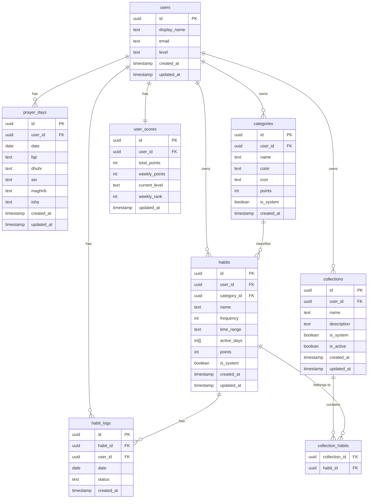

# ERD — Murabbi Mobile (tables Supabase attendues)

**Version** : Phase 0
**Date** : 2026-04-27

## Notes

- Toutes les tables ont RLS activé (règle S-2)
- `categories` et `collections` : les lignes `is_system = true` sont créées par
  les admins (via `murabbi-admin`) — les utilisateurs ne peuvent pas les modifier
- `prayer_days` : contrainte unique sur `(user_id, date)`
- `habit_logs` : contrainte unique sur `(habit_id, user_id, date)`
- `user_scores` : calculé via trigger ou Edge Function, jamais écrit directement par le client
- Les colonnes `updated_at` sont gérées par trigger automatique
